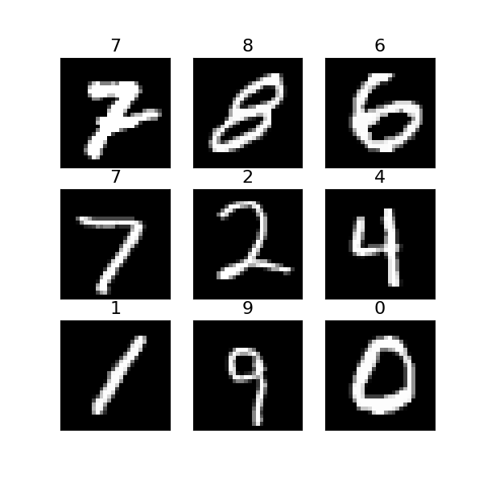
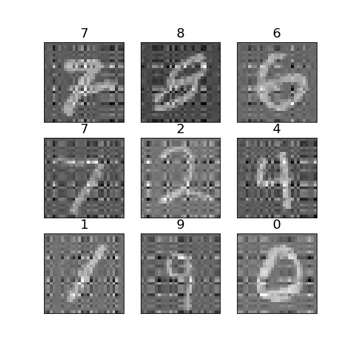
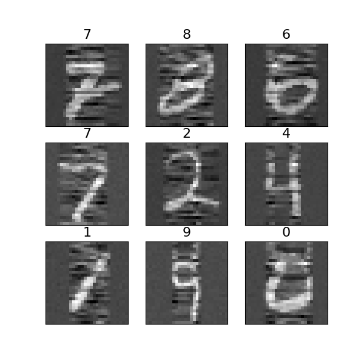
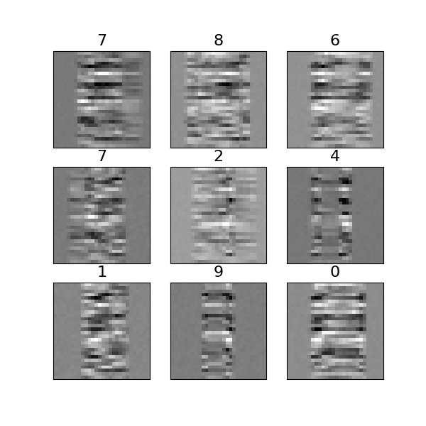
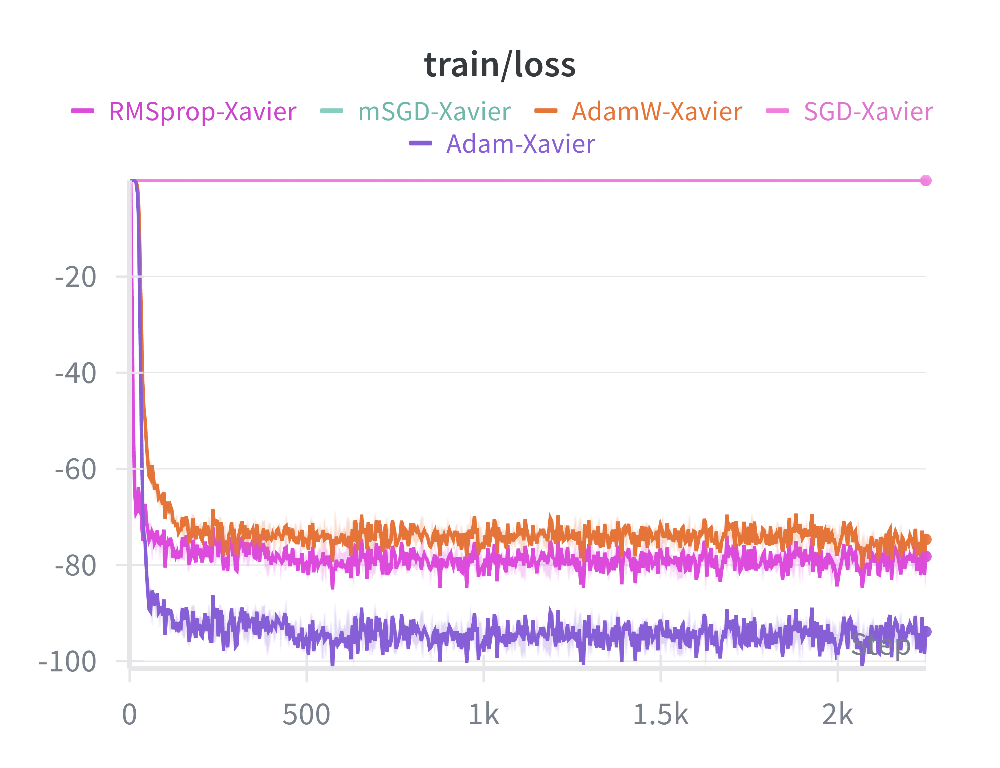
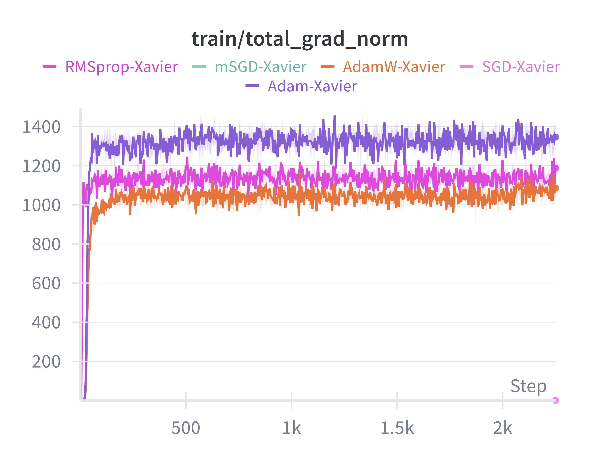
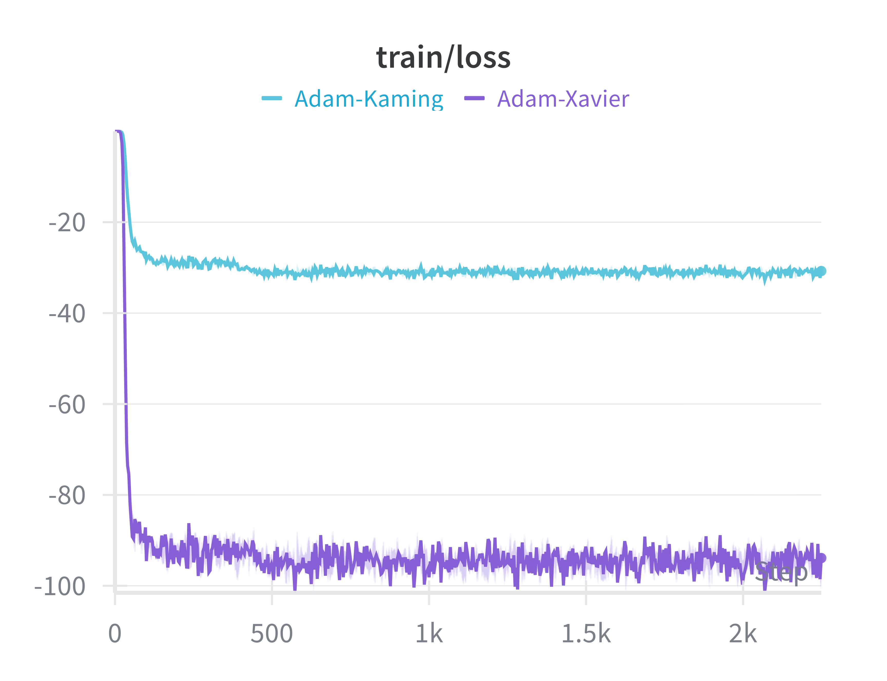
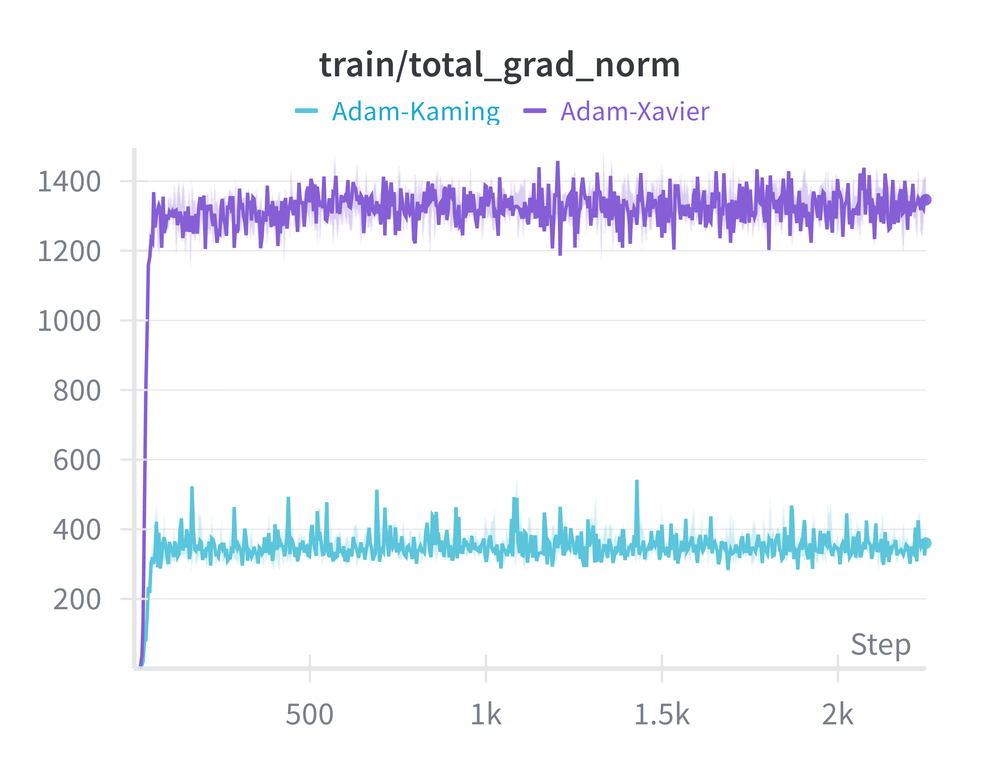
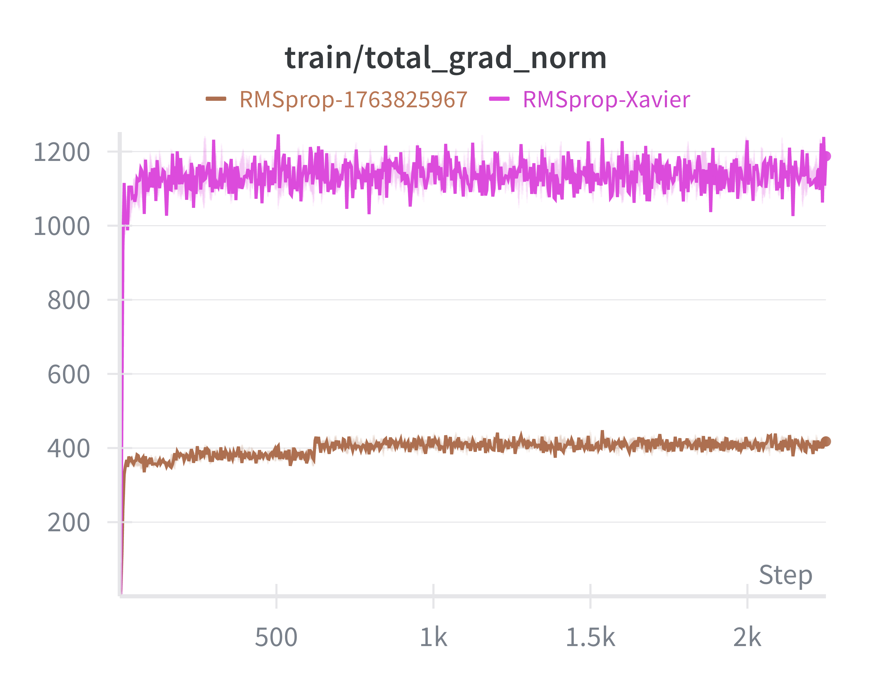
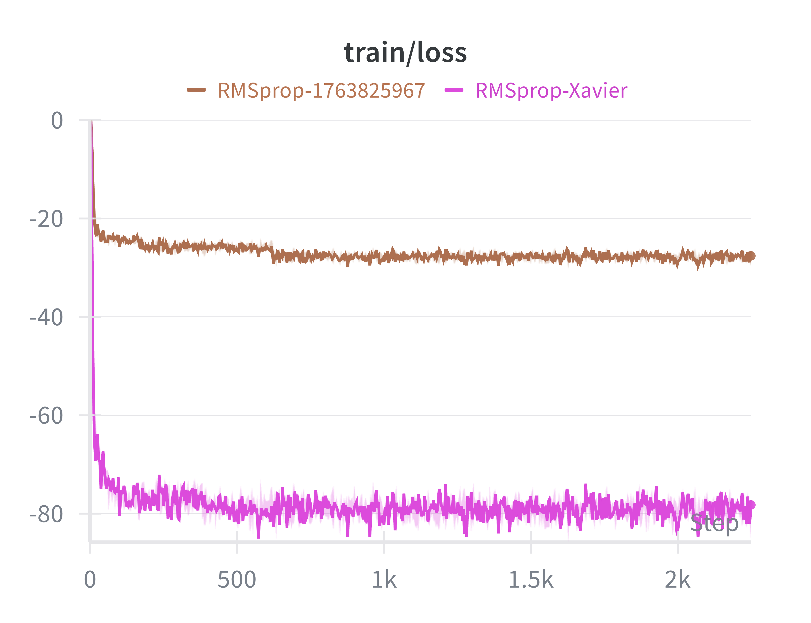

# AdRegNets - Adversarial Regularization Networks

This repository implements Adversarial Regularization Networks (AdReg) for solving ill-posed inverse problems, with a focus on image reconstruction from noisy measurements.

## Overview

Adversarial Regularization Networks provide a learned regularization approach for inverse problems. Unlike traditional methods like Tikhonov regularization (L2), AdReg learns to discriminate between true solutions and naive reconstructions, offering superior noise suppression while preserving important features.

## Features

- **Multiple Optimization Algorithms**: Comparison of SGD, Momentum SGD, Adam, AdamW, and RMSprop for training AdReg
- **MNIST Toy Example**: Demonstrates crack detection simulation using MNIST digits with added noise
- **Regularization Comparison**: Benchmarks against:
  - No regularization (least squares)
  - Tikhonov regularization (L2)
  - Adversarial regularization (AdReg)

## Key Results

### Visual Comparison

The following figures demonstrate the reconstruction quality of different methods on MNIST digits:

<table>
  <tr>
    <td align="center">
      
      <br />Ground Truth
    </td>
    <td align="center">
      
      <br />Recovered (AdReg)
    </td>
    <td align="center">
      
      <br />Perturbed (lstsq)
    </td>
  </tr>
  <tr>
    <td align="center">
      
      <br />Perturbed (Adam)
    </td>
    <td align="center">
      
      <br />Perturbed (L2)
    </td>
    <td align="center">
      
      <br />Measurements
    </td>
  </tr>
</table>

**Figure 1**: Examples from MNIST and inverse-problem solutions by different methods. "Recovered" uses adversarial regularizers; "lstsq" is least squares without regularization; "Adam" has no weight decay; "L2" is Tikhonov regularization.


### Training Dynamics

#### Optimizer Comparison

<table>
  <tr>
    <td align="center">
      
      <br />Training Loss
    </td>
    <td align="center">
      
      <br />Gradient Norm
    </td>
  </tr>
</table>

**Figure 2**: Performance comparison of Adam, RMSprop, and SGD optimizers.

**Key Observations:**
- Adaptive methods (Adam, RMSprop, AdamW) successfully train the model, with Adam achieving the lowest loss.
- SGD and mSGD fail completely due to vanishing gradients in flat regions—adaptive rescaling is essential for escaping the "dead zone".
- RMSprop shows faster early gradient growth, while Adam achieves lower final loss through momentum-based refinement.

#### Impact of Initialization

<table>
  <tr>
    <td align="center">
      
      <br />Adam: Training Loss
    </td>
    <td align="center">
      
      <br />Adam: Gradient Norm
    </td>
  </tr>
  <tr>
    <td align="center">
      
      <br />RMSprop: Training Loss
    </td>
    <td align="center">
      
      <br />RMSprop: Gradient Norm
    </td>
  </tr>
</table>

**Figure 3**: Performance comparison of Adam and RMSprop with different initialization schemes.

**Key Observations:**
- Xavier initialization consistently outperforms Kaiming, producing larger gradients and faster convergence.
- For adversarial regularization on ill-posed inverse problems, adaptive optimizers with proper initialization are critical for success.

## Requirements

```bash
pip install torch numpy matplotlib wandb
```

## Usage

### Training AdReg

Open and run the Jupyter notebook:

```bash
Adversial_regularizer.ipynb
```
and
```bash
python run.py
```

The notebook includes:
1. Data preparation with MNIST dataset
2. Forward operator (linear map) and noise injection
3. AdReg network architecture (CNN-based)
4. Training loop with different optimizers
5. Visualization and comparison of results

## Methodology

### Inverse Problem Formulation

```
y = A(x) + ε
x* = argmin ||A(x) - y||₂² + Φ_θ(x)
```

Where:
- `x`: Model parameter (ground truth image)
- `y`: Measurements (noisy observations)
- `A`: Forward operator (linear transformation)
- `ε`: Observation noise
- `Φ_θ`: Learned adversarial regularizer

### AdReg Architecture

The adversarial regularizer is implemented as a Convolutional Neural Network (CNN) that learns to distinguish between:
- Ground truth images (real samples)
- Naive reconstructions from least squares (fake samples)

## Training

AdReg is trained using the following loss:

```
L_i = Φ_θ(x_r) - Φ_θ(x_n)
```

Where `x_r` is a ground truth sample and `x_n` is a naive reconstruction.

## References

[1] S. Lunz, O. Öktem, and C.-B. Schönlieb, "Adversarial regularizers in inverse problems," 2018
